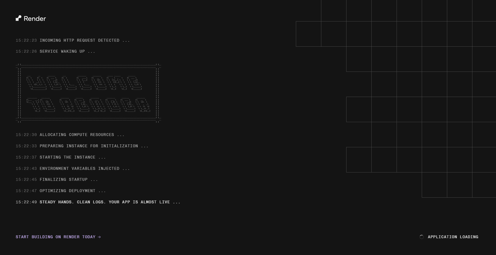

# TAG AI Engineering Bootcamp: Cohort 1

## Team Optimizers: Project 1

This repository contains Team Optimizers' work for Project 1 of the TAG AI Engineering Bootcamp.

## Team Members

- Hannah Igboke (Project Lead)
- Nunsi Shiaki
- Rachel Onyeamachi Iwebuke
- Salaudeen Sheriffdeen
- Atujuna Emmanuel
- Jayeoba Victor

## NorthStack Customer Intelligence Classifier

An AI-powered platform that automatically classifies incoming customer messages by **intent**, **sentiment**, and **priority**, then routes each one to the correct specialist team; built for NorthStack, a mid-size B2B SaaS company.

## Project Brief

NorthStack's internal teams receive a high volume of messages daily including support tickets, in-app feedback, and reviews, arriving via email, Slack, and CSV exports. Today, a small team of coordinators manually triages every message before it reaches the right specialist team, creating a bottleneck as volume grows.

This project builds a system that automatically:
1. Reads an incoming message (from email, Slack, or a bulk CSV upload)
2. Classifies its **intent** (which of 10 teams it belongs to), **sentiment** (Positive / Neutral / Negative), and **priority** (low / medium / high)
3. Routes it to the correct team
4. Surfaces everything through a live dashboard and per-team queue views

Full business context and architecture reasoning: see the `PRD_Customer_Intelligence_Classifier.md` in the docs folder.

## Objectives

- Diagnose and justify the right ML approach for the problem (classical ML vs. DL vs. LLM vs. RAG vs. agents) rather than defaulting to the most fashionable option
- Train and evaluate real classifiers on a genuine, non-toy dataset, with honest reporting of accuracy, limitations, and failure modes
- Support ingestion from multiple real channels (Slack, email, CSV) through one shared classification core
- Provide a usable dashboard for both leadership (overall analytics) and individual teams (their own queue)
- Design and deploy within real infrastructure constraints (free-tier hosting, no budget), documenting trade-offs made along the way.

## Tech Stack

| Layer | Technology |
|---|---|
| **ML / Classification** | Python, scikit-learn (Logistic Regression / SVM), TF-IDF (`TfidfVectorizer`) |
| **Backend API** | FastAPI, SQLAlchemy, Alembic (migrations), Pydantic |
| **Database** | PostgreSQL (Docker locally, managed Postgres on Render) |
| **Frontend** | Flask, Jinja2 |
| **Ingestion** | Slack Bolt SDK, IMAP (email polling) |
| **Dataset** | [Tobi-Bueck/customer-support-tickets](https://huggingface.co/datasets/Tobi-Bueck/customer-support-tickets) (Hugging Face) |
| **Deployment** | Render (Postgres + FastAPI backend + Flask frontend, as separate services) |
| **Version control** | Git, Git LFS (for trained model files) |

## Project Structure

```
c1-optimizers-project-1/
│
├── ai-ml-backbone/                # Core ML: feature extraction + classification logic
│   ├── classify.py                # classify_and_route() — the single source of truth
│   ├── eda-model-development-notebook.ipynb
│   └── models/                    # Trained models + fitted TF-IDF vectorizer — Git LFS
│
├── backend/                       # FastAPI application
│   ├── main.py                    # App entrypoint, router registration, model warmup
│   ├── config.py / database.py / models.py / schemas.py
│   ├── routers/                   # health, ingest, tickets
│   └── services/                  # classifier (ML bridge), adapters, repository, analytics
│
├── frontend/                      # Flask application
│   └── webapp/
│       ├── blueprints/main.py     # All page routes
│       └── templates/             # home, dashboard, team_queues, classify, bulk_upload, glossary
│
├── alembic/                       # Database migrations
├── docker-compose.yml             # Local Postgres
├── scripts/
│   ├── seed_db.py                 # Populate DB with real-classified sample data
│   ├── slack_listener.py          # Live Slack ingestion
│   ├── poll_email.py              # Live email ingestion (IMAP polling)
│   └── llm_classifier.py          # Local LLM comparison (Ollama)
│
├── docs
│   ├── Application_loading.png
│   ├── Architecture_diagram.png
│   ├── NorthStack Presentation slides.pptx   
│   ├── Video demo.mp4
│   └── PRD_Customer_Intelligence_Classifier.md
├── requirements.txt
└── README.md
```

## Getting Started

This is the link to the deployed application on Render: https://flask-frontend-xkru.onrender.com/

NOTE: Chances are that when you click on the link it would show you the page below:



It is totally fine and not an issue. We used the free tier of the Render platform which means that the application spins down after 15 minutes of inactivity. And so when you click on the link give it about 2-3 minutes or less for it to come up.

## Team Workflow

1. Create a branch before working on a feature or task.
2. Do not work directly on the main branch.
3. Push changes to your branch.
4. Open a pull request when the work is ready.
5. Another team member should review the pull request before it is merged.
6. Keep commit messages clear and descriptive.
7. Never commit passwords, API keys, tokens or other secrets.

## Mentor

Assigned mentor: Bash

## Programme

TAG AI Engineering Bootcamp: Cohort 1
