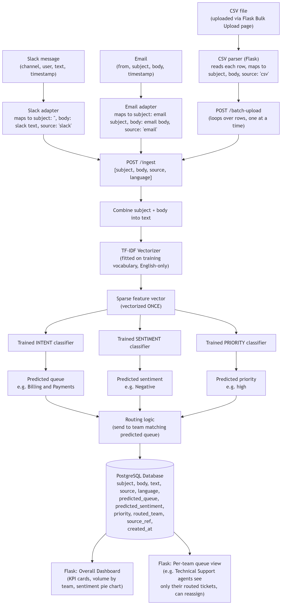

# Product Requirements Document
## Customer Intelligence Classifier — Intent, Sentiment & Priority Routing

**Team:** Team Optimizers | **Version:** 2.0 | **Status:** Reflects implemented system

---

## 1. Product Overview

The Customer Intelligence Classifier is an AI-powered message classification and routing system built for **NorthStack**, a mid-size B2B SaaS company based in Germany providing collaboration and IT-infrastructure tooling (project management, cloud storage, device/network management) to customers across the US, UK, and DACH region.

NorthStack receives customer messages through multiple channels — a support inbox (email), Slack, and bulk CSV exports from an external feedback platform. Today, every message is placed into a shared queue and manually reviewed by coordinators who decide which of 10 specialist teams should handle it.

The system automates this process: every incoming message is analyzed and classified by **intent** (which team should handle it), **sentiment** (how the customer feels), and **priority** (how urgent it is), then routed to the appropriate team automatically.

---

## 2. Problem Statement

NorthStack's coordinators manually read and triage every incoming message before routing it. As message volume grows, this creates a bottleneck: urgent issues sit in queue as long as routine ones, classification is inconsistent across coordinators, and the product team has no systematic view of sentiment trends — only anecdotal impressions from whichever messages happen to get escalated.

The system should reduce manual triage work while giving both coordinators and leadership real, structured visibility into message volume, sentiment, and team workload.

---

## 3. Product Vision

Build a reliable customer intelligence system that automatically understands, classifies, and routes incoming customer messages — making routing faster, more consistent, and measurable than manual triage, with results surfaced through a live dashboard.

---

## 4. Goals and Objectives

### 4.1 Primary Goals
- Automatically classify incoming customer messages into one of 10 team queues
- Predict customer sentiment (Positive / Neutral / Negative)
- Predict message priority (low / medium / high) to support triage
- Automatically route every classified message to its predicted team
- Support ingestion from **Slack**, **email**, and **bulk CSV upload** through one shared classification core
- Provide a live dashboard for monitoring message volume, team workload, and sentiment trends
- Provide per-team queue views, with the ability to manually reassign a message to a different team
- Diagnose and justify the ML approach used, rather than defaulting to the most fashionable option
- Compare the classical ML approach against local LLMs on the same task, with real accuracy and latency evidence

### 4.2 Secondary Goals
- Provide a glossary reference explaining team responsibilities, sentiment definitions, and priority definitions for anyone using the platform
- Allow date-range filtering on the dashboard
- Display the underlying customer identifier where available (email sender, Slack user)

**Note:** Confidence-scored routing, a human-review/correction workflow, and model versioning were considered during planning but are **not part of the current implementation** — see Section 7.2 (Out of Scope).

---

## 5. Target Users

| User | Needs |
|---|---|
| Coordinators | A dashboard view of all incoming messages, their predicted team/sentiment/priority, and the ability to reassign a misrouted message |
| Specialist Teams | Messages routed automatically to their queue, with priority and sentiment visible at a glance |
| Product / Operations Managers | Message volume by team, sentiment trends, and overall system activity |

---

## 6. User Stories

### Coordinator
- As a coordinator, I want to see all incoming messages and their predicted team/sentiment/priority, so I can monitor triage at a glance.
- As a coordinator, I want to reassign a message to a different team if it was misrouted, so the right team handles it.
- As a coordinator, I want to upload a CSV of messages exported from another platform, so I can bulk-process a backlog.

### Specialist Team Member
- As a team member, I want messages routed to my queue automatically, so I can focus on solving customer problems.
- As a team member, I want to see message priority and sentiment, so I can understand urgency and customer experience without reading every message first.

### Manager
- As a manager, I want to see message volumes by team, so I can understand workload distribution.
- As a manager, I want to see sentiment trends, so I can monitor customer experience over time.

---

## 7. Product Scope & Constraints

### 7.1 In Scope (Implemented)

| In Scope | Description |
|---|---|
| Message ingestion | Slack (Socket Mode live listener), Email (IMAP polling), CSV bulk upload |
| Message classification | Intent (10 teams), sentiment (3 classes), priority (3 levels) |
| Automated routing | Every classified message is routed to its predicted team |
| Manual reassignment | Coordinators can reassign a message to a different team via the Team Queues page |
| Dashboard | KPI cards, volume-by-team chart, sentiment distribution, recent messages, date-range filter |
| Team Queues | Per-team filtered view of routed messages |
| Glossary | Reference page explaining team responsibilities, sentiment, and priority definitions |
| Bulk CSV upload | Synchronous processing with per-row success/failure reporting |
| Backend | FastAPI, PostgreSQL, Alembic migrations |
| Frontend | Flask |
| LLM comparison | Local LLMs (Ollama — Mistral, Llama 3.1) evaluated against the classical ML approach on the same test set |

### 7.2 Out of Scope / Future Enhancements

| Out of Scope | Notes |
|---|---|
| Confidence scoring + review threshold | Not implemented — every prediction is routed directly |
| Human-in-the-loop correction / Triage queue | Not implemented — no corrections table, no feedback loop into retraining |
| Model versioning per prediction | Not implemented |
| German-language support | Dropped — see Section 18 (Assumptions) for why |
| Asynchronous CSV processing / job progress tracking | Current implementation processes uploads synchronously, row by row |
| Model-quality monitoring dashboard (precision/recall/F1 in-app) | Metrics are documented in this PRD and the training notebook, not surfaced live in the UI |
| Model drift/observability monitoring | Not implemented |
| Authentication | Not implemented — internal tool, current release |
| Duplicate-content detection | Not implemented |

### 7.3 Constraints

- The system currently supports exactly 10 team queues, 3 sentiment classes, and 3 priority levels
- The system currently supports **English only** (see Section 18)
- Classification logic lives inside the backend service directly (`ai-ml-backbone`/`classify.py`), not as a separate model microservice
- Deployment targets free-tier hosting (Render for backend/frontend/database) — see Section 14 for the resulting constraints

---

## 8. Classification Requirements

The classifier predicts, for every incoming message:

1. **Intent** — one of 10 team queues: Billing and Payments, Customer Service, General Inquiry, Human Resources, IT Support, Product Support, Returns and Exchanges, Sales and Pre-Sales, Service Outages and Maintenance, Technical Support
2. **Sentiment** — one of: Positive, Neutral, Negative
3. **Priority** — one of: low, medium, high

The system supports **English-language messages only** in the current release.

---

## 9. Functional Requirements

| Requirement | Description |
|---|---|
| **FR-01: Message Ingestion** | The system provides ingestion via `POST /ingest` (generic), `POST /ingest/slack`, `POST /ingest/email`, and `POST /batch-upload` (CSV). All paths converge on the same `classify_and_route()` core. |
| **FR-02: Message Classification** | Every message is classified into one team queue, one sentiment class, and one priority level. |
| **FR-03: Automated Routing** | Every classified message is routed to its predicted team; no confidence threshold gating in the current release. |
| **FR-04: Manual Reassignment** | Coordinators can reassign a message's team via the Team Queues page. |
| **FR-05: Bulk Upload** | Users can upload a CSV; the system processes it synchronously and reports processed/failed counts with per-row error detail. |
| **FR-06: Message Retrieval** | `GET /tickets` supports filtering by queue, sentiment, and source, with pagination. |
| **FR-07: Dashboard Analytics** | `GET /tickets/analytics` and `GET /tickets/analytics/volume` provide aggregate counts (by queue, sentiment, priority, source) and time-series volume, with optional date-range filtering. |
| **FR-08: Live Ingestion** | Slack messages arrive via a Socket Mode listener (or Events API webhook, once publicly hosted); email arrives via periodic IMAP polling. |
| **FR-09: Health Checks** | `GET /health` and `GET /health/ready` report liveness and readiness (database + model load status). |

---

## 10. User Interface Requirements

| Screen | Purpose |
|---|---|
| Home | Platform overview, company context, navigation entry points |
| Classify | Submit a single message and see its predicted intent, sentiment, and priority |
| Bulk Upload | Upload a CSV and see processed/failed counts |
| Dashboard | KPI cards (total messages, teams, priority breakdown), volume-by-team chart, sentiment distribution, recent messages, date filter |
| Team Queues | Per-team filtered message list with reassignment controls |
| Glossary | Reference tables explaining team responsibilities, sentiment meanings, and priority meanings |

---

## 11. Data Sources

Customer messages enter the system from:
- **Email** (IMAP-polled support inbox)
- **Slack** (live message events)
- **CSV upload** (bulk export from an external feedback platform, uploaded by coordinators)

All three channels are normalized to a common `{subject, body, source, language}` shape by dedicated adapters before reaching the shared classification core — this is a deliberate design principle: one core function, multiple thin entry points.

---

## 12. End-to-End Product Workflow

A message enters through Slack, email, or CSV upload → is normalized by its channel adapter → combined into a single text field → converted to TF-IDF features → classified by three trained models (intent, sentiment, priority) → routed to the predicted team → persisted to PostgreSQL → visible on the dashboard and in the relevant team's queue view.

---

## 13. System Architecture

| Component | Primary Responsibility |
|---|---|
| **ai-ml-backbone** (`classify.py`) | Loads the fitted TF-IDF vectorizer and three trained classifiers; exposes `classify_and_route()` |
| **Backend (FastAPI)** | Message ingestion, routing logic, persistence, message queries, analytics aggregation |
| **Frontend (Flask)** | Home, Classify, Bulk Upload, Dashboard, Team Queues, Glossary screens |
| **PostgreSQL** | Persistent storage for all classified messages |
| **Slack listener / Email poller** | Live ingestion scripts (Socket Mode / IMAP), forwarding to the backend's ingestion endpoints |

---

## 14. Non-Functional Requirements

- The backend, ML classification logic, database, and frontend are separated into independently deployable services communicating over HTTP, so each can be developed and tested independently.
- Bulk CSV uploads are processed synchronously in the current release; large files may take proportionally longer with no progress indicator (see Section 7.2).
- The system is deployed on free-tier hosting. This directly shaped a real architecture decision: the original approach used multilingual sentence embeddings (`sentence-transformers`/`torch`), which required more memory than free-tier hosting provides. The system was redesigned to use **TF-IDF** instead, which removes the deep-learning dependency at the cost of dropping German-language and cross-lingual support — a deliberate, documented trade-off, not an oversight.
- Model-drift/observability monitoring is not part of the current release (Section 7.2).

---

## 15. Success Metrics / KPIs

| Category | Metrics |
|---|---|
| Model | Per-class precision/recall/F1 for intent, sentiment, and priority (measured on a held-out test set — see training notebook for full results) |
| Comparison | Classical ML (TF-IDF + SVM/LR) evaluated against local LLMs (Mistral, Llama 3.1) on the same test messages — accuracy and latency |
| Operations | Messages processed by source (Slack/email/CSV); volume by team; sentiment distribution over time |

Correction-rate tracking and live model-version performance comparison are not available, since no correction/versioning workflow exists in the current release (Section 7.2).

---

## 16. Acceptance Criteria

- **Classification:** A valid message (via `/ingest`, `/ingest/slack`, `/ingest/email`, or CSV row) returns predicted queue, sentiment, and priority.
- **Routing:** Every classified message is assigned to a team matching its predicted queue.
- **Reassignment:** A coordinator can change a message's team via the Team Queues page, and the change persists.
- **Bulk Processing:** CSV upload returns processed/failed counts and per-row error detail.
- **Dashboard:** KPI cards, volume-by-team, sentiment distribution, and recent messages all reflect real data from the database.
- **Live Ingestion:** A real Slack message and a real email both result in a new, correctly classified ticket within a reasonable delay.

---

## 17. Risks and Mitigations

| Risk | Impact | Mitigation |
|---|---|---|
| Semantically overlapping categories (Technical/IT/Product Support, Customer Service) | Classification confusion between these teams | Documented in the confusion matrix analysis; flagged as a candidate for category consolidation in future work |
| Free-tier hosting memory limits | ML dependencies (embeddings/torch) could not run in production | Switched to TF-IDF, English-only, as a deliberate trade-off |
| Generated sentiment labels (no ground truth in source data) | Sentiment model's accuracy ceiling is bounded by label quality | Validated against a human-labeled sample; limitation documented |
| No confidence-based review step | A misclassified message could be routed without any human check | Manual reassignment is available on the Team Queues page as a mitigation, though it is reactive rather than proactive |
| Email polling delay | Live email demo has a short but real lag before ingestion | Runs as a background task inside the backend at a short interval, acceptable for demo purposes |

---

## 18. Assumptions

- Incoming messages contain sufficient text for classification.
- **Messages are in English.** German-language support was originally planned (the source dataset and NorthStack's actual customer base are bilingual), but was dropped after the original multilingual embedding-based approach could not fit within free-tier hosting memory limits. This is a documented, deliberate scope reduction — not an oversight.
- Each message belongs to one primary team queue, one sentiment class, and one priority level.
- PostgreSQL is available for persistent storage.
- The classification logic is accessible via direct import within the backend process (not a separate networked model service).
- CSV uploads follow the expected `subject`/`body` schema.

---

## 19. Deliverables

- Trained classification models (intent, sentiment, priority) and fitted TF-IDF vectorizer
- FastAPI backend with ingestion, routing, and analytics endpoints
- PostgreSQL database schema and Alembic migrations
- Flask frontend (Home, Classify, Bulk Upload, Dashboard, Team Queues, Glossary)
- Slack live-ingestion listener and email IMAP poller
- This PRD and accompanying architecture diagrams
- Sample/demo CSV datasets for testing bulk upload

---

## 20. Team Ownership

| Track | Primary Responsibilities |
|---|---|
| ML Track | Data cleaning, TF-IDF feature pipeline, intent/sentiment/priority classifiers, model evaluation, LLM comparison |
| Engineering Track | Backend API (FastAPI), database schema and migrations, Flask frontend, live ingestion (Slack/email), deployment |

Both tracks integrate through `classify.py`'s `classify_and_route()` function, imported directly by the backend.

---

## 21. Definition of Done

- The backend and frontend can each be started and run locally (and are deployed on Render).
- A message can enter through Slack, email, or CSV upload.
- The message is classified into a team, sentiment, and priority, and routed accordingly.
- A coordinator can reassign a misrouted message via Team Queues.
- The dashboard reflects real, live data.
- The full workflow — Slack message in, email in, CSV upload in, all visible on the dashboard — can be demonstrated end to end.

---

## 22. Final Product Definition

The Customer Intelligence Classifier is an internal AI-assisted customer-routing platform that transforms unstructured customer messages into actionable routing, sentiment, and priority information.

Its core value proposition:

**Receive → Classify → Route → Surface on Dashboard**

The current release automates classification and routing directly, with manual reassignment available as a safety net rather than a formal confidence-gated review workflow. This reflects a deliberate scope decision for the project's timeline, with confidence-based triage and human-correction feedback loops identified as natural next steps (Section 7.2).

---